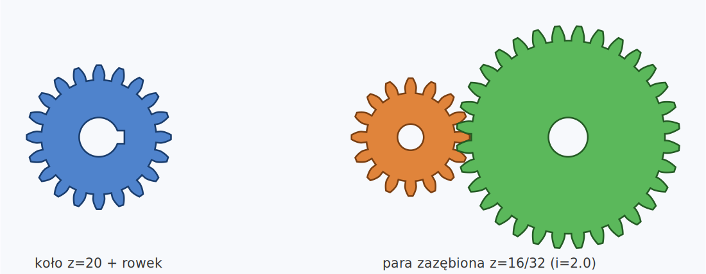
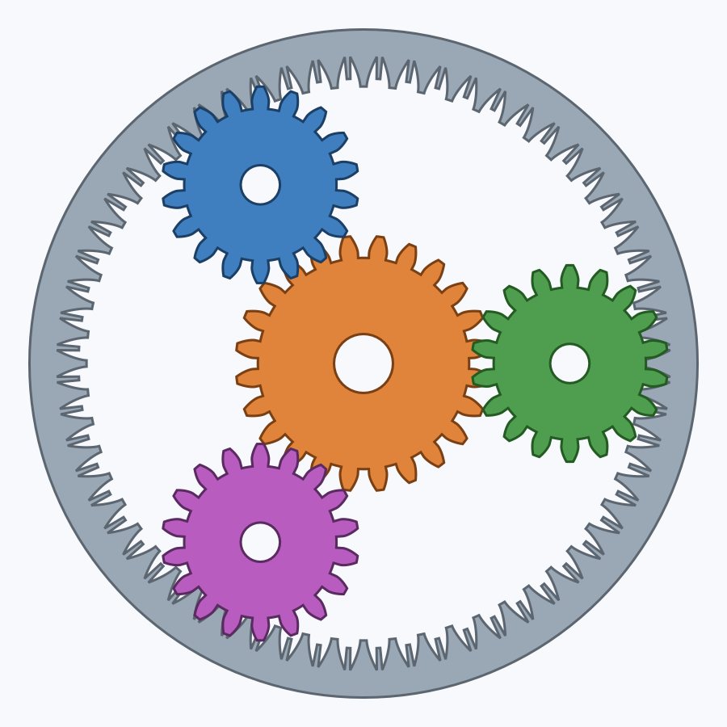
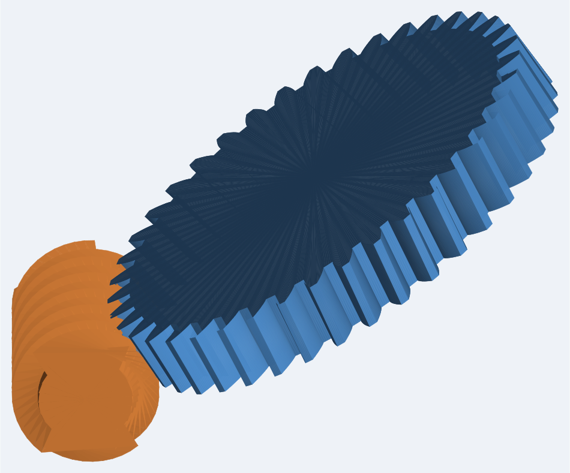
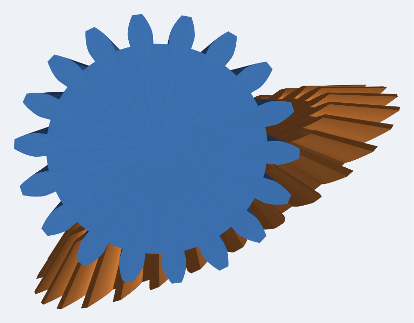
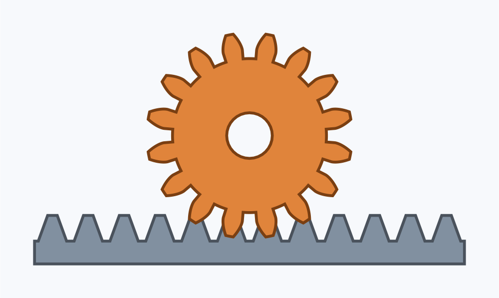
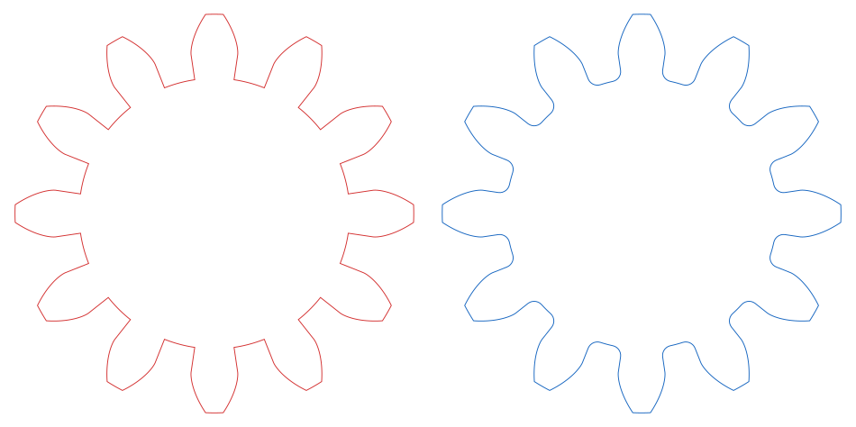

# geargen — Generator przekładni i kół zębatych do CAD (STEP)

Kompletny, **w pełni samodzielny** (czysty Python 3, zero zależności) generator
ewolwentowych **kół zębatych i przekładni** z eksportem do **CAD w formacie STEP
(ISO 10303-21, AP214)** oraz do **DXF** i **SVG**.

Generowane pliki STEP to prawdziwe, wodoszczelne bryły B-rep (nie siatki) —
otwierają się w FreeCAD, SolidWorks, Fusion 360, Onshape, Inventor, CATIA.
Każdy typ został zweryfikowany jądrem **OpenCASCADE** (`isValid = True`), a
zazębienia par/przekładni mają **zerową kolizję** zębów.

> **EN:** Self-contained, dependency-free involute **gear & gearbox generator**
> exporting real watertight **STEP** B-rep solids (+ DXF/SVG). Polish-first docs;
> English notes inline.



---

## 🧩 Wszystkie przekładnie / All transmissions

<table>
<tr>
<td width="50%"><b>Planetarna (obiegowa)</b><br>słońce + satelity + wieniec, zerowa kolizja<br></td>
<td width="50%"><b>Ślimakowa (worm)</b><br>ślimak + ślimacznica, duże przełożenie<br></td>
</tr>
<tr>
<td><b>Stożkowa (bevel) 90°</b><br>napęd kątowy, zęby zbieżne do wierzchołka<br></td>
<td><b>Zębatkowa (rack & pinion)</b><br>zamiana ruchu obrotowego na liniowy<br></td>
</tr>
</table>

| Przekładnia | Klasa | Przełożenie |
|---|---|---|
| Para walcowa (zew./wew.) | `GearPair` | `z2/z1` |
| Wielostopniowa | `GearTrain` | iloczyn stopni |
| **Planetarna (epicyclic)** | `PlanetaryGearSet` | `1+z_r/z_s` (wieniec stały) |
| **Stożkowa (bevel) 90°** | `BevelPair` | `z2/z1` |
| **Ślimakowa (worm)** | `WormDrive` | `z_wheel/z_starts` |
| **Zębatkowa (rack & pinion)** | `RackAndPinion` | `π·d` na obrót |

Koła: **walcowe proste, skośne (helical), daszkowe (herringbone), wewnętrzne
(ring), stożkowe (bevel), ślimak (worm), zębatka (rack)**.

---

## 🛠️ Komplikacja geometrii / Realistic detail

- **Trochoidalne/promieniowe zaokrąglenie stopy zęba** (root fillet) — gładkie,
  wytrzymalsze dno wrębu.
- **Korpus:** piasta (hub, jedno- lub dwustronna), **ramiona/tarcza
  odciążająca** (spokes/web), otwory odciążające.
- **Otwór:** gładki, z **rowkiem wpustowym** (keyway) lub **wielowypustem**
  (spline).

<p align="center">
  <br>
  <sub>Po lewej ostre dno wrębu, po prawej z zaokrągleniem (fillet).</sub>
</p>

---

## 📊 Raporty inżynierskie / Engineering reports

Dla każdej pary/przekładni: prędkość obwodowa, **siły w zazębieniu**
(obwodowa Ft, promieniowa Fr, osiowa Fa, normalna Fn), moc, **naprężenia
gnące (Lewis)** ze współczynnikiem dynamicznym Kv, sprawność, obroty/momenty
wyjściowe.

---

## 🚀 Szybki start (CLI)

```bash
# Pojedyncze koło: m=2, z=24, b=12, otwór 12, rowek 4x1.8, fillet 0.6
python -m geargen gear -m 2 -z 24 -w 12 --bore 12 --keyway 4x1.8 --fillet 0.6 \
       -o kolo.step --dxf kolo.dxf --svg kolo.svg

# Koło daszkowe (herringbone) + wielowypust
python -m geargen gear -m 2 -z 30 --helix 25 --herringbone -w 24 \
       --spline 8,12,15 -o daszkowe.step

# Koło z ramionami i piastą
python -m geargen gear -m 3 -z 48 -w 16 --fillet 0.8 \
       --spokes 5,44,110,14 --hub 44,12,both -o korpus.step

# Para zazębiona (z raportem sił)
python -m geargen pair -m 2 --pinion 18 --wheel 45 -w 14 --rpm 1500 --torque 25 \
       --bore-p 10 --bore-w 16 -o para.step

# Przekładnia planetarna (słońce 24, satelita 18, 3 satelity)
python -m geargen planetary -m 2 --sun 24 --planet 18 --planets 3 \
       --bore-sun 12 --bore-planet 8 -o planetarna.step

# Przekładnia stożkowa 90°
python -m geargen bevel -m 3 --pinion 18 --wheel 27 -w 14 -o stozkowa.step

# Przekładnia ślimakowa (2 zwoje, ślimacznica 40 zębów)
python -m geargen worm -m 3 --starts 2 --worm-d 32 --wheel 40 -o slimakowa.step

# Zębatka + zębnik
python -m geargen rack -m 2 -z 14 --pinion 16 --bore 8 -o zebatka.step

# Przekładnia wielostopniowa (3×3 = 9:1)
python -m geargen train -m 1.5 --stages 16:48,18:54 -o train.step

# Arkusz danych / kalkulator przełożeń
python -m geargen info  -m 2 -z 17
python -m geargen ratio --target 4.5 --min 14 --max 90
```

---

## 🐍 API w Pythonie

```python
from geargen import (GearParams, Gear, GearBuild, GearPair, PlanetaryGearSet,
                     PlanetaryParams, BevelPair, WormParams, WormDrive,
                     write_step)
from geargen.gear import Spokes, Hub, Spline, Keyway

# Koło z ramionami, piastą i zaokrągleniem stopy
g = Gear(GearParams(module=4, teeth=50, helix_angle=12, face_width=30,
                    root_fillet=1.2),
         GearBuild(bore=40,
                   spokes=Spokes(6, hub_diameter=80, rim_inner_diameter=170,
                                 spoke_width=22),
                   hub=Hub(diameter=70, height=18, both_sides=True)))
write_step(g.to_solid(), "kolo.step")

# Przekładnia planetarna
pgs = PlanetaryGearSet(PlanetaryParams(module=2, z_sun=24, z_planet=18,
                                       n_planets=3, face_width=12),
                       bore_sun=12, bore_planet=8)
print(pgs.report()["ratio_ring_fixed"])     # 3.5
write_step(pgs.solids(), "planetarna.step")  # słońce + 3 satelity + wieniec

# Przekładnia ślimakowa
wd = WormDrive(WormParams(module=3, starts=2, pitch_diameter=32, length=55),
               wheel_teeth=40)
print(wd.ratio)                              # 20.0
write_step(wd.solids(), "slimakowa.step")
```

Pełne przykłady w katalogu [`examples/`](examples/) (01–10).

---

## 📐 Podstawy teoretyczne / Theory

| Wielkość | Wzór |
|---|---|
| Średnica podziałowa | `d = m·z / cos β` |
| Średnica zasadnicza  | `d_b = d·cos α_t` |
| Średnice wierzchołków / stóp | `d_a = d ± 2m(h_a*+x)`, `d_f = d ∓ 2m(h_f*−x)` |
| Funkcja ewolwentowa | `inv(α) = tan α − α` |
| Odległość osi robocza | `a_w = a·cos α_t / cos α_w` |
| Planetarna: wieniec | `z_r = z_s + 2·z_p`, montaż: `(z_s+z_r) mod N = 0` |
| Stożkowa (90°) | `tan δ_1 = z_1/z_2`, `δ_1+δ_2 = 90°` |
| Ślimakowa | `i = z_wheel/z_starts`, kąt wzniosu `tan λ = z_w·m/d_w` |
| Siła obwodowa / gnąca | `F_t = 2T/d`, `σ = F_t·K_v/(b·m·Y)` |

---

## 🧪 Testy i weryfikacja

```bash
python -m unittest discover -s tests -v      # 38 testów, zero zależności
```

Każda bryła ma test wodoszczelności bez CAD-a:

```python
solid = Gear(GearParams(2, 20, face_width=10)).to_solid()
assert solid.is_closed_manifold()            # każda krawędź = dokładnie 2 ściany
```

Dodatkowo wszystkie typy zweryfikowano jądrem **OpenCASCADE**: poprawność bryły
(`isValid`), dodatnia objętość, oraz **zerowa kolizja** zębów w zazębieniach
(para, planetarna). `cadquery` jest *opcjonalne* — służy tylko do weryfikacji.

---

## 📦 Instalacja

Generator działa wprost: `python -m geargen ...`. Instalacja polecenia
`geargen`:

```bash
pip install .
geargen planetary -m 2 --sun 24 --planet 18 -o planetarna.step
```

Weryfikacja brył (opcjonalnie): `pip install cadquery`.

---

## 📁 Struktura projektu

```
geargen/
  geometry.py      zarys ewolwentowy, parametry koła, fillet
  gear.py          model 3D koła (bore/keyway/spline/spokes/hub/herringbone)
  solid.py         topologia bryły (manifold B-rep, extrude + stepped)
  step.py          zapis STEP ISO 10303-21 (AP214)
  transmission.py  pary i przekładnie wielostopniowe
  planetary.py     przekładnia planetarna (obiegowa)
  bevel.py         koła i przekładnia stożkowa
  worm.py          ślimak i przekładnia ślimakowa
  rack.py          zębatka i przekładnia zębatkowa
  engineering.py   siły, naprężenia Lewisa, prędkości, moc
  report.py        arkusz danych, eksport DXF i SVG
  cli.py           interfejs wiersza poleceń
examples/          przykłady 01–10
tests/             testy jednostkowe (38)
```

## 📜 Licencja

BSD 2-Clause (patrz [LICENSE](LICENSE)).
