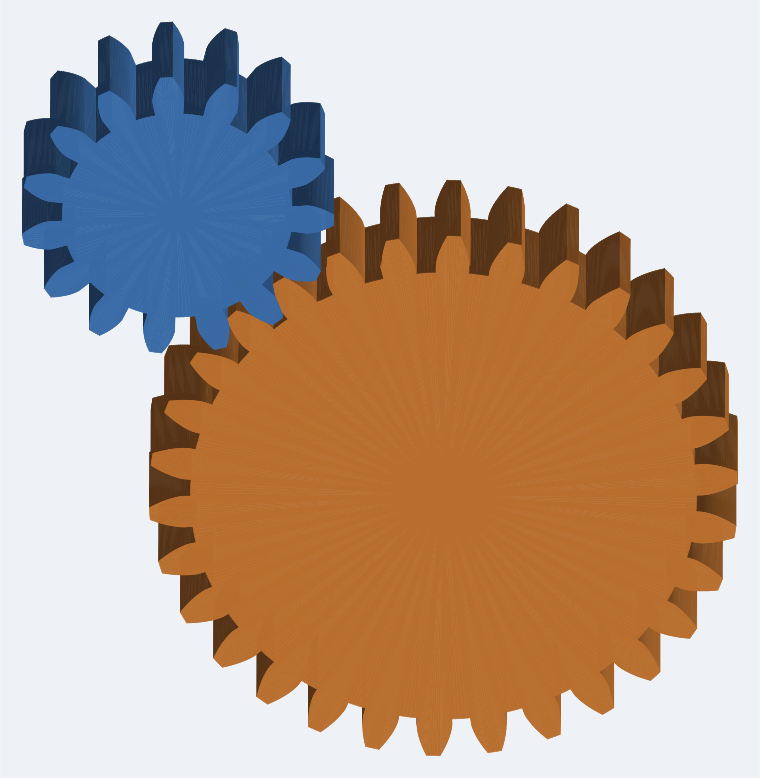

# geargen — Kalkulator i generator przekładni oraz kół zębatych (STEP / CAD)

Kompletny, **w pełni samodzielny** (czysty Python 3, zero zależności) generator
ewolwentowych **kół zębatych i przekładni** z eksportem do **CAD w formacie STEP
(ISO 10303-21, AP214)** oraz do **DXF** i **SVG**.

Generowane pliki STEP to prawdziwe, wodoszczelne bryły B-rep (a nie siatki) —
otwierają się w FreeCAD, SolidWorks, Fusion 360, Onshape, Inventor, CATIA itp.
Każda bryła została zweryfikowana jądrem OpenCASCADE (`isValid = True`).

> **EN:** A self-contained, dependency-free involute **gear & gearbox
> generator** that exports real watertight **STEP** B-rep solids (plus DXF/SVG).
> See the English notes inline.


<p align="center">
  
  
</p>

<sub>Powyższe rysunki wygenerowano bezpośrednio tym narzędziem (rzut z brył STEP).</sub>

---

## ✨ Możliwości / Features

- **Koła walcowe o zębach prostych** (spur gears) — pełny zarys ewolwentowy.
- **Koła o zębach skośnych** (helical gears) — skręcenie wzdłuż szerokości.
- **Koła wewnętrzne / pierścieniowe** (internal / ring gears).
- **Korekcja zazębienia** (profile shift `x`), regulowany kąt przyporu, luz.
- **Otwór piasty (bore), rowek wpustowy (keyway), otwory odciążające.**
- **Przekładnie** — para kół (pinion + koło) z poprawnym **przełożeniem**,
  **odległością osi** i **fazą zazębienia** (zęby wchodzą w luki — zero kolizji).
- **Przekładnie wielostopniowe** (gear trains) — przełożenie całkowite, obroty.
- **Kalkulator przełożeń** — dobór liczby zębów do zadanego przełożenia.
- **Eksport:** STEP 3D (CAD), DXF 2D (laser/WaterJet/2D-CAD), SVG (podgląd),
  arkusz danych (data sheet) z wszystkimi parametrami.
- **Zero zależności** — działa na czystym Pythonie 3.8+ (tylko `math`).

---

## 🚀 Szybki start (CLI)

Nie wymaga instalacji — wystarczy Python 3.

```bash
# Pojedyncze koło: m=2, z=24, szerokość 12 mm, otwór 12 mm, rowek 4x1.8
python -m geargen gear -m 2 -z 24 -w 12 --bore 12 --keyway 4x1.8 \
       -o kolo.step --dxf kolo.dxf --svg kolo.svg

# Koło skośne (helical), 20°
python -m geargen gear -m 3 -z 40 -w 20 --helix 20 --bore 25 -o helical.step

# Koło wewnętrzne (ujemna liczba zębów)
python -m geargen gear -m 2 -z -60 -w 12 -o ring.step

# Para zazębiona (przekładnia jednostopniowa) w jednym pliku STEP
python -m geargen pair -m 2 --pinion 18 --wheel 45 -w 14 \
       --bore-p 10 --bore-w 16 --rpm 1500 --torque 15 -o para.step

# Przekładnia dwustopniowa (przełożenie 3 x 3 = 9)
python -m geargen train -m 1.5 --stages 16:48,18:54 -w 10 -o train.step

# Arkusz danych koła (bez generowania pliku)
python -m geargen info -m 2 -z 17

# Kalkulator przełożeń — dobór zębów dla przełożenia 4.5
python -m geargen ratio --target 4.5 --min 14 --max 90
```

---

## 🐍 API w Pythonie

```python
from geargen import GearParams, Gear, GearBuild, GearPair, write_step
from geargen.gear import Keyway, LighteningHoles

# --- pojedyncze koło ---
params = GearParams(module=2.0, teeth=24, pressure_angle=20,
                    helix_angle=0, face_width=12, profile_shift=0.0)
build = GearBuild(bore=12, keyway=Keyway(width=4, depth=1.8))
write_step(Gear(params, build).to_solid(), "kolo.step")

# --- przekładnia (para zazębiona) ---
pinion = GearParams(module=2, teeth=18, face_width=14)
wheel  = GearParams(module=2, teeth=45, face_width=14)
pair = GearPair(pinion, wheel,
                GearBuild(bore=10), GearBuild(bore=16))
print(pair.ratio)            # 2.5
print(pair.working_center)   # 63.0 mm
write_step(pair.solids(), "przekladnia.step")   # 2 bryły, zazębione
```

Więcej w katalogu [`examples/`](examples/).

---

## 📐 Podstawy teoretyczne / Theory

Geometria opiera się na klasycznej teorii zazębień ewolwentowych:

| Wielkość | Wzór |
|---|---|
| Średnica podziałowa | `d = m · z / cos β` |
| Średnica zasadnicza  | `d_b = d · cos α_t` |
| Średnica wierzchołkowa | `d_a = d ± 2·m·(h_a* + x)` |
| Średnica stóp | `d_f = d ∓ 2·m·(h_f* − x)` |
| Podziałka | `p = π · m` |
| Grubość zęba (na d) | `s = m·(π/2 + 2·x·tan α)` |
| Funkcja ewolwentowa | `inv(α) = tan α − α` |
| Odległość osi (robocza) | `a_w = a · cos α_t / cos α_w` |

Czynny zarys boku zęba między kołem zasadniczym a wierzchołkowym to prawdziwa
ewolwenta koła zasadniczego; poniżej koła zasadniczego bok schodzi promieniowo do
koła stóp. Koła skośne modelowane są jako zarys czołowy skręcony osiowo o
`Δφ = 2·b·tan β / d`.

---

## 🧱 Jak powstaje bryła STEP

1. Zarys czołowy koła generowany jest jako wieloboczna aproksymacja ewolwenty
   (gęstość regulowana parametrem `--flank-pts`).
2. Zarys jest „wytłaczany” (extrude) w bryłę: dwie pokrywy płaskie (z otworami:
   bore/keyway/odciążenia) + ściany boczne triangulowane (dzięki czemu pozostają
   płaskie nawet przy skręceniu koła skośnego).
3. Topologia zapisywana jest jako `MANIFOLD_SOLID_BREP` ze **wspólnymi
   wierzchołkami i krawędziami** → szczelna, poprawna bryła.

Każdą bryłę można sprawdzić bez CAD-a:

```python
solid = Gear(GearParams(module=2, teeth=20, face_width=10)).to_solid()
assert solid.is_closed_manifold()     # wodoszczelność (każda krawędź = 2 ściany)
```

---

## 🧪 Testy i weryfikacja

```bash
python -m unittest discover -s tests -v      # 18 testów, zero zależności
```

Pliki STEP zostały dodatkowo zweryfikowane jądrem **OpenCASCADE** (przez
`cadquery`): poprawność bryły (`isValid`), dodatnia objętość, oraz **zerowa
kolizja** zębów w parach zazębionych. `cadquery` jest *opcjonalne* — służy tylko
do weryfikacji, sam generator go nie potrzebuje.

---

## 📦 Instalacja (opcjonalna)

Generator działa wprost z katalogu (`python -m geargen ...`). Aby zainstalować
polecenie `geargen` w systemie:

```bash
pip install .
geargen gear -m 2 -z 20 -o kolo.step
```

Do weryfikacji brył (opcjonalnie): `pip install cadquery`.

---

## 📁 Struktura projektu

```
geargen/
  geometry.py      zarys ewolwentowy, parametry koła (GearParams)
  gear.py          model 3D koła (bore, keyway, helical, odciążenia)
  solid.py         budowa topologii bryły (manifold B-rep)
  step.py          zapis STEP ISO 10303-21 (AP214)
  transmission.py  pary i przekładnie wielostopniowe (przełożenia, fazy)
  report.py        arkusz danych, eksport DXF i SVG
  cli.py           interfejs wiersza poleceń
examples/          gotowe przykłady
tests/             testy jednostkowe
```

---

## 📜 Licencja

BSD 2-Clause (patrz [LICENSE](LICENSE)).
